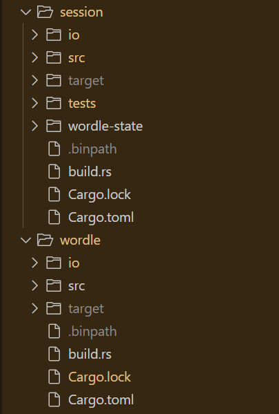

# Task Description
For this assignment, you are tasked with writing the Wordle game.

Wordle is a captivating word-guessing game that has become popular for its simplicity and addictive gameplay. The goal is to guess a hidden word within a limited number of attempts.

The game board consists of six rows, each allowing the player to input a word. Upon entering a word, the player receives feedback indicating the presence of letters in the hidden word and their correct positions. If a letter is present but in the wrong position, it may be highlighted in a different color or marked with a distinct symbol. Players utilize these clues to deduce the correct letters and their placements.

The game challenges players to guess the word with the fewest attempts, under time constraints and limited attempts, adding excitement and suspense.

# Project Structure
Break down your Wordle game into two programs for a more engaging and flexible experience. The Wordle program will handle the core functionalities, such as selecting a random word from a list and evaluating guesses. The Game Session program will manage user interactions, keep track of the game state, and enforce time constraints. This division aims to create a modular, flexible system that enhances the gaming experience.

1. Description of the Wordle program:

Contains "start the game" and "check the word" functions.
A word bank exists within the program for selecting a random word at the game's start.
"Start the game" function initiates the game and selects a random word.
"Check the word" function assesses the player's guess against the hidden word, providing feedback on correct letter positions.

2. Description of the Game Session program:

Manages interactions with the Wordle program and oversees the gameplay.
Tracks previous responses and the number of attempts.
Monitors the elapsed time since the game started to manage time constraints and events.

3. Interaction Between the Programs:

The user initiates the game by sending a message to the Game Session program.
The Game Session program invokes the Wordle program's "start the game" function.
The user submits their guesses to the Game Session program, which forwards them to the Wordle program's "check the word" function.
The Wordle program returns feedback on the guess's accuracy and letter positions.
The Game Session program analyzes the result, tracking attempts and time.

4. Key Implementation Aspects:

The Game Session program requires mechanisms to store data about previous moves and track time.
Efficient interaction with the Wordle program through data exchange and response handling is crucial.

# Deployment and Use
https://idea.gear-tech.io/  
wss://testnet.vara.network 

aiqubits_wordle_game  program id
0x98de5336075b2550ff6ee7b3ec4b72b4856412a5df580f4f5118fcb0e87f7a25

https://idea.gear-tech.io/programs/0x98de5336075b2550ff6ee7b3ec4b72b4856412a5df580f4f5118fcb0e87f7a25?node=wss%3A%2F%2Ftestnet.vara.network

aiqubits_session_game  program id
0xdb3552cb90e74ad9bc15f4804830e7e01a34bea4f4c2093eb4657ffdecb1a8b6

https://idea.gear-tech.io/programs/0xdb3552cb90e74ad9bc15f4804830e7e01a34bea4f4c2093eb4657ffdecb1a8b6?node=wss%3A%2F%2Ftestnet.vara.network

